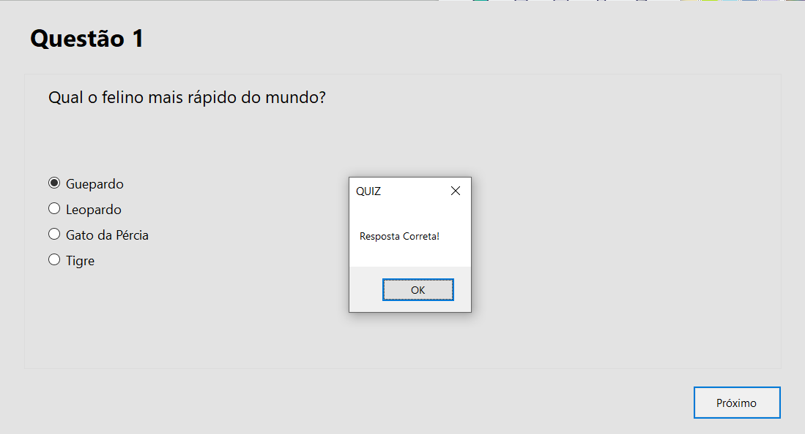

## QUIZ GAME 

### RESUMO

Projeto com fins de estudo e aprendizado da IDE Visual Studio utilizando Formulários do Windows e C# em sua programação.

### DESCRIÇÃO

Criar uma aplicação Windows Forms (WinForms) que realize um Quiz com 10 perguntas e ao final apresente para o usuário sua quantidade de acertos e erros.

### INTERAÇÕES

A aplicação conta com três tipos de tela:

- Inicial - O usuário será instruído sobre o que está acontecendo e quais ações ele pode tomar.

- Respondendo o Quiz - O usuário selecionará uma alternativa e, ao clicar no botão para a próxima pergunta, uma mensagem será exibida dizendo se a questão está correta ou incorreta e seguirá para a próxima questão.

- Final - Ao final das 10 questões serem confirmadas, será exibido para o usuário a ultima janela que mostrará a quantidade de acertos e erros, juntamente com as opções de sair da aplicação ou reiniciar e voltar para a tela inicial da aplicação.

### MELHORIAS FUTURAS

- Diminuir a quantidade de processamento utilizando menos formulários;
- Melhorar a parte visual da aplicação;
- Disponibilizar um executável para a aplicação.
